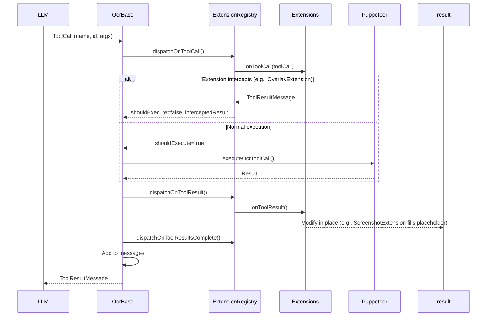

# Infrastructure Documentation

This document provides an overview of the `pi-web-search` project structure, architecture, and design patterns to help users and agents understand how the codebase is organized.

---

## Table of Contents

1. [Project Overview](#project-overview)
2. [Directory Structure](#directory-structure)
3. [Architecture Overview](#architecture-overview)
4. [Core Components](#core-components)
5. [Summarizer V2 Architecture](#summarizer-v2-architecture)
6. [Tool/Extension Pattern](#tool-extension-pattern)
7. [Configuration](#configuration)
8. [Development Guidelines](#development-guidelines)

---

## Project Overview

**pi-web-search** is a web search and fetch tool extension for the [pi](https://github.com/itterative/pi) AI coding agent. It provides:

- **Web Search**: Search using DuckDuckGo or Kagi providers
- **Web Fetch**: Fetch and summarize web content with LLM
- **Web Explore**: Interactive browsing with full tool access (click, scroll, type, etc.)
- **OCR Support**: Extract text from images (requires vision-capable LLM)

---

## Directory Structure

```
pi-web-search/
├── index.ts                    # Extension entry point
├── tools/                      # High-level tools (web-search, web-fetch, web-explore)
│   ├── web-search.ts          # Search functionality
│   ├── web-fetch.ts           # Fetch & summarize
│   └── web-explore.ts         # Interactive exploration
├── providers/                  # Search provider implementations
│   ├── base.ts                # Provider base class
│   ├── index.ts               # Provider exports
│   ├── kagi-web.ts            # Kagi search provider
│   └── duckduckgo-web.ts      # DuckDuckGo provider
├── summarizers/                # Content summarizer implementations
│   ├── base.ts                # Summarizer interface + registry
│   ├── index.ts               # Summarizer registration and selection
│   ├── markdown-html.ts       # Markdown/HTML summarizer (with outline-based large page handling)
│   ├── outline/               # Outline-based selection for large pages
│   │   ├── extract.ts         # extractOutline(), extractSelectedContent()
│   │   ├── select.ts          # Model selection call + JSON parsing + retry
│   │   └── instructions/      # Eta templates for outline prompts
│   ├── ocr-v2.ts              # OCR V2 Summarizer interface adapter
│   └── ocr/                   # V2 OCR summarizer core
│       ├── config.ts          # OcrRunOptions type
│       ├── ocr.ts             # OcrBase class - main orchestrator
│       ├── ocr-summarizer-base.ts  # OcrSummarizerConfig, buildOcrConfig factory
│       ├── ocr-full-v2.ts     # Full content extraction
│       ├── ocr-summarize-v2.ts # Concise summaries
│       ├── ocr-explore-v2.ts  # Full tool access
│       ├── response-utils.ts  # Response parsing helpers
│       ├── screenshot.ts      # Screenshot capture + coordinate grid overlay
│       ├── state.ts           # InteractionConfig, InteractionPositioning, Checkpoint
│       ├── instructions/      # Eta templates for prompts
│       │   ├── index.ts       # render(), renderWithFallback()
│       │   ├── base/          # Shared templates (checkpoint, compression)
│       │   ├── full/          # Full mode templates
│       │   ├── summarize/     # Summarize mode templates
│       │   ├── explore/       # Explore mode templates
│       │   └── overlay/       # Overlay handling templates
│       ├── extensions/        # Extension lifecycle hooks
│       │   ├── base.ts        # OcrExtension, OcrExtensionHooks, OcrExtensionExecutionContext
│       │   ├── registry.ts    # OcrExtensionRegistry
│       │   ├── checkpoint.ts  # CheckpointExtension (context compression)
│       │   ├── cursor.ts      # CursorExtension (cursor state tracking)
│       │   ├── debug.ts       # DebugExtension (screenshot saving)
│       │   ├── navigation.ts  # NavigationExtension (page history)
│       │   ├── overlay.ts     # OverlayExtension (captcha/overlay handling)
│       │   ├── screenshot.ts  # ScreenshotExtension (placeholder filling)
│       │   └── index.ts       # Extension re-exports
│       └── tools/             # Tool implementations
│           ├── base.ts        # OcrTool base class
│           ├── index.ts       # Tool exports + executeOcrToolCall()
│           ├── checkpoint.ts  # Save progress
│           ├── click.ts       # Click elements
│           ├── cursor.ts      # Hover to inspect
│           ├── dismiss-overlay.ts  # Overlay handling trigger
│           ├── find.ts        # Find interactive elements
│           ├── keyboard.ts    # Send keystrokes
│           ├── navigate.ts    # Navigate URLs/history
│           ├── screenshot.ts  # Capture viewport
│           ├── scroll.ts      # Scroll page
│           ├── type.ts        # Type into inputs
│           ├── wait.ts        # Wait for content
│           └── zoom.ts        # Zoom into area
├── common/                     # Shared utilities
│   ├── config.ts              # Configuration handling (WebSearchConfig)
│   ├── browser.ts             # Puppeteer setup
│   ├── constants.ts           # Constants
│   └── utils.ts               # Utility functions
├── docs/                       # Documentation
│   ├── CONFIGURATION.md       # Full config reference
│   ├── schema.json            # JSON Schema validation
│   ├── INFRASTRUCTURE.md      # This file
│   └── agent/                 # Agent-specific guides
├── test/                       # Unit tests (Vitest)
├── debug/                      # Debug screenshots (gitignored)
├── plans/                      # Development plans
├── .pi/                        # Pi extension config
├── package.json
└── tsconfig.json
```

---

## Architecture Overview

### Entry Point

```typescript
// index.ts
export default function (pi: ExtensionAPI) {
    webSearchTool(pi);
    webFetchTool(pi);
    webExploreTool(pi);
}
```

### High-Level Tools

Each tool in `tools/` directory orchestrates the workflow:

1. **web-search.ts**: Searches using configured providers
2. **web-fetch.ts**: Fetches URL and summarizes content (supports `summarize`, `full`, and `instruct` modes)
3. **web-explore.ts**: Interactive exploration with full tool access

### Summarizer Registry

The `summarizers/index.ts` registers and selects summarizers by priority:

- `ocr-v2` (priority 50): Vision-based OCR summarization using V2 architecture
- `markdown-html`: Fallback for text-based content

### Summarizer Hierarchy

```
OcrBase (ocr.ts)
├── FullOcrSummarizerV2 (ocr-full-v2.ts)     - scroll only
├── SummarizeOcrSummarizerV2 (ocr-summarize-v2.ts) - cursor, click, scroll, screenshot
└── ExploreOcrSummarizerV2 (ocr-explore-v2.ts) - all tools (12 tools)
```

---

## Core Components

### 1. Tools (`summarizers/ocr/tools/`)

Tools are Puppeteer-based actions that the LLM can invoke:

| Tool              | Purpose                         | Parameters                                    |
| ----------------- | ------------------------------- | --------------------------------------------- |
| `cursor`          | Move cursor to inspect elements | `x`, `y`, `description?`                      |
| `click`           | Click elements                  | `x?`, `y?`, `text?`, `exact?`, `description?` |
| `scroll`          | Scroll page                     | `direction?`, `to?`, `mode?`                  |
| `screenshot`      | Capture viewport                | `debug?`                                      |
| `find`            | Find interactive elements       | `role?`, `label?`, `text?`, `multiple?`       |
| `navigate`        | Navigate URLs/history           | `url?`, `delta?`                              |
| `type`            | Type into inputs                | `text`, `description?`, `insert?`, `submit?`  |
| `keyboard`        | Send keystrokes                 | `key`, `modifiers?`, `repeat?`                |
| `wait`            | Wait for content                | `seconds?`                                    |
| `checkpoint`      | Save findings                   | `title`, `content`                            |
| `zoom`            | Zoom into area                  | `x`, `y`, `width`, `height`, `level`          |
| `dismiss-overlay` | Dismiss overlays/captchas       | `description?`, `status?`, `message?`         |

**Note**: `dismiss-overlay` is registered by `OcrBase` when overlay handling is enabled. Its execution is intercepted by `OverlayExtension.onToolCall`, not executed directly.

### 2. Extensions (`summarizers/ocr/extensions/`)

Extensions hook into the interaction lifecycle:

| Extension             | Purpose                      | Key Hooks                                                                                                |
| --------------------- | ---------------------------- | -------------------------------------------------------------------------------------------------------- |
| `CursorExtension`     | Manage cursor state          | `onInit`, `onToolCall`, `onToolResult`                                                                   |
| `NavigationExtension` | Track page history           | `onInit`, `onToolCall`, `onToolResult`                                                                   |
| `OverlayExtension`    | Handle captchas/overlays     | `onToolCall`, `onRoundStart`, `onBeforeCompletion`, `onFilterTools`, `onFilterExecutionTools`, `onError` |
| `ScreenshotExtension` | Fill screenshot placeholders | `onToolResult`, `onBeforeCompletion`                                                                     |
| `DebugExtension`      | Debug screenshots/logging    | `onInit`, `onToolCall`, `onToolResult`, `onRoundEnd`, `onError`, `onComplete`, `onMessagesChanged`       |
| `CheckpointExtension` | Context compression          | `onRoundStart`, `onToolCall`, `onToolResultsComplete`, `onRoundEnd`, `onResponse`                        |

### 3. Configuration (`common/config.ts`)

Configuration is loaded from JSON files with priority:

1. Environment variables
2. Project config (`.pi/web-search-config.json`)
3. Global config (`~/.pi/web-search-config.json`)
4. Defaults

---

## Summarizer V2 Architecture

### Factory Pattern

Summarizers are created via factory functions:

```typescript
import {
    createFullOcrSummarizerV2,
    createSummarizeOcrSummarizerV2,
    createExploreOcrSummarizerV2,
} from "./summarizers/ocr/index";
```

### Three Modes

| Mode          | Purpose                      | Tools                                    | Use Case                    |
| ------------- | ---------------------------- | ---------------------------------------- | --------------------------- |
| **Full**      | Extract all content          | Scroll                                   | Full page content           |
| **Summarize** | Create concise summaries     | Cursor, Click, Scroll, Screenshot        | Quick summaries             |
| **Explore**   | Follow specific instructions | All 12 tools (including dismiss-overlay) | Complex tasks, form filling |

### Base Class (`OcrBase`)

The `OcrBase` class orchestrates the interaction loop:

```typescript
async run(options: OcrRunOptions): Promise<SummarizerResult> {
    // 1. Set viewport (config.width x config.maxHeight)
    // 2. Build extension context (collect initial state, build message management)
    // 3. dispatchOnBeforeRun() - let extensions modify options
    // 4. Build initial message with screenshot
    // 5. For each round (0 to maxRounds-1):
    //    a. dispatchOnRoundStart() → Can skip round
    //    b. runRound():
    //       - complete() API call (with dispatchOnBeforeCompletion)
    //       - Track token usage
    //       - Handle empty responses (llamacpp bug)
    //       - Push to messages
    //       - dispatchOnResponse() (handle checkpoints, compression)
    //       - If no tool calls → model done (extract summary or break)
    //       - For each toolCall:
    //         - dispatchOnToolCall() → Extensions can intercept
    //         - executeOcrToolCall() → Puppeteer action
    //         - dispatchOnToolResult() → Extensions modify result
    //       - dispatchOnToolResultsComplete()
    //    c. dispatchOnRoundEnd()
    // 6. Force final summary
    //    - dispatchOnFinalSummary()
    //    - complete() → Get final response
    //    - dispatchOnComplete()
}
```

### Extension Lifecycle

Extensions implement hooks that fire at specific points:

| Hook                      | When                   | Purpose                                                         |
| ------------------------- | ---------------------- | --------------------------------------------------------------- |
| `getInitialState()`       | Before run             | Contribute initial state (merged into context)                  |
| `onBeforeRun()`           | Before initial message | Modify options (e.g., overlay handling changes screenshot)      |
| `onRoundStart()`          | Each round start       | Skip round or request checkpoint                                |
| `onBeforeCompletion()`    | Before API call        | Modify messages (e.g., inject overlay guidance)                 |
| `onResponse()`            | After API response     | Handle compression, checkpoint text responses                   |
| `onToolCall()`            | Before tool exec       | **Intercept** tool execution (return ToolResultMessage)         |
| `onToolResult()`          | After tool result      | **Modify result in place** (e.g., fill screenshot placeholders) |
| `onToolResultsComplete()` | After all tools        | Batch operations (e.g., log checkpoint usage)                   |
| `onRoundEnd()`            | End of round           | Trigger compression, save debug data                            |
| `onFinalSummary()`        | Before final summary   | Final prep                                                      |
| `onComplete()`            | After completion       | Final cleanup, save debug data                                  |
| `onError()`               | On error               | Cleanup (e.g., pop overlay messages)                            |
| `onMessagesChanged()`     | On message changes     | Debug/tracking (push/pop/replace/append/truncate)               |

**Note**: `onInit` is dispatched by `OcrBase.run()` after building the extension context, before `onBeforeRun`. Use it to reset per-run state. Extensions are reused across runs, so state must be reset in `onInit` or `getInitialState`.

### Message Management

The execution context provides message management with stack support:

```typescript
ctx.appendMessages(messages, source); // Append messages
ctx.replaceMessages(messages, source); // Replace all messages
ctx.truncateMessages(count, source); // Truncate to count
ctx.pushMessages(source); // Push current to stack, clear
ctx.popMessages(source); // Restore from stack
```

All operations trigger `onMessagesChanged` with a typed `MessageChange` event.

### Tool/Extension Interaction



---

## Configuration

### File Locations

- **Project**: `.pi/web-search-config.json`
- **Global**: `~/.pi/web-search-config.json`

### Quick Example

```json
{
    "$schema": "https://raw.githubusercontent.com/itterative/pi-web-search/refs/heads/main/docs/schema.json",
    "search": {
        "provider": "duckduckgo-web",
        "maxResults": 10
    },
    "fetch": {
        "model": {
            "provider": "anthropic",
            "modelId": "claude-3-haiku-20240307"
        },
        "useOcr": true
    }
}
```

### Environment Variables

| Variable                          | Description                                  |
| --------------------------------- | -------------------------------------------- |
| `KAGI_SESSION_TOKEN`              | Kagi authentication token                    |
| `WEBSEARCH_PROVIDER`              | Override provider                            |
| `WEBSEARCH_CONFIG_PATH`           | Custom project config path                   |
| `WEBSEARCH_CONFIG_PATH_GLOBAL`    | Custom global config path                    |
| `PI_WEB_SEARCH_DEBUG`             | Enable debug logging (`"1"` or `"true"`)     |
| `PI_WEB_SEARCH_DEBUG_SCREENSHOTS` | Enable debug screenshots (`"1"` or `"true"`) |
| `PI_WEB_SEARCH_DEBUG_DIR`         | Debug output directory (default: `"debug"`)  |

---

## Development Guidelines

### Adding a New Tool

1. Create `tools/my-tool.ts` extending `OcrTool`:

    ```typescript
    export class MyTool extends OcrTool<MyToolContext> {
        constructor(ctx: MyToolContext, options?: OcrToolOptions) {
            super({
                name: "my-tool",
                description: "...",
                promptSnippet: "...",
                promptGuidelines: "...",
                parameters: Type.Object({...}),
            }, ctx, options);
        }

        async execute(context: OcrToolExecutionContext, args: Static<typeof MyToolParams>): Promise<ToolResultMessage> {
            // Implementation
        }
    }
    ```

2. Export in `tools/index.ts`:

    ```typescript
    export { MyTool } from "./my-tool";
    ```

3. Register in summarizer constructor:
    ```typescript
    this.registerTool(new MyTool({ ... }));
    ```

### Adding a New Extension

1. Create `extensions/my-extension.ts` extending `OcrExtension`:

    ```typescript
    export class MyExtension extends OcrExtension {
        readonly name = "my-extension";

        override getInitialState(): Partial<OcrBaseStateInterface> {
            return { myState: createMyState() };
        }

        async onToolCall(ctx, toolCall) {
            // Intercept or let pass
        }

        async onToolResult(ctx, toolCall, result) {
            // Modify result in place
        }
    }
    ```

2. Export in `extensions/index.ts`:

    ```typescript
    export { MyExtension } from "./my-extension";
    ```

3. Register in `OcrBase` constructor (or subclass):
    ```typescript
    this.registerExtension(new MyExtension({ ... }));
    ```

### Best Practices

- **No `any` types**: Use proper TypeScript types
- **Screenshot placeholders**: Use `screenshotPlaceholderSuccessMessage()` for tools that change the page (filled by `ScreenshotExtension`)
- **Error handling**: Return `ToolResultMessage` with `isError: true` for failures
- **Navigation tracking**: Call `navigationExtension.registerNavigationTool("tool-name")` in tool constructor if the tool causes navigation
- **Positioning**: Support both absolute and relative coordinate systems via `InteractionPositioning`
- **Network idle**: Use `waitForNetworkIdleAfterInteraction()` after browser actions

### Testing

- **Unit tests**: `test/` directory with Vitest
- **Run specific test**: `npx vitest --run test/specific.test.ts`
- **Type checking**: `npx tsc --noEmit`
- **Formatting**: `npx prettier -c [FILES ...]` (or `-w` to autofix)
- **Do not run**: `npm run dev`, `npm run build`
- **Note**: `npm run check` does not run tests

---

## Key Design Patterns

### 1. Factory Pattern

Summarizers are created via factory functions that bundle all dependencies:

```typescript
export function createExploreOcrSummarizerV2(config: OcrSummarizerConfig): ExploreOcrSummarizerV2;
```

### 2. Registry Pattern

Extensions are managed via `OcrExtensionRegistry` for type-safe access:

```typescript
const registry = new OcrExtensionRegistry();
registry.register(extension);
const ext = registry.get(SomeExtension); // instanceof-based lookup
```

### 3. Extension Hooks

Lifecycle hooks allow extensions to hook into specific points without modifying core logic.

### 4. Screenshot Placeholders

Tools return placeholder images that extensions fill in:

```typescript
protected screenshotPlaceholderSuccessMessage(
    context: OcrToolExecutionContext,
    message: string,
    addition: "raw" | "debug" = "raw"
): ToolResultMessage;
```

The `ScreenshotExtension` detects empty-data images with `image/png+raw` or `image/png+debug` MIME types and fills them with actual screenshots.

### 5. Context Compression

`CheckpointExtension` handles context limits by:

- Requesting checkpoints when usage reaches `checkpointThreshold - 0.1` (default 70%)
- Forcing compression at `checkpointThreshold` (default 80%) or 90% critical threshold
- Blocking non-checkpoint tools during compression mode
- Replacing conversation with checkpoint text + current screenshot
- Consolidating checkpoints when progress stalls (explore mode only)
- Supporting template-based prompts for each mode

### 6. Message Stack

The execution context supports a message stack for nested conversations (e.g., overlay handling):

- `pushMessages()` saves current messages and starts fresh
- `popMessages()` restores the previous messages
- `onMessagesChanged` fires for all operations

### 7. Eta Templates

All prompts are defined as `.eta` templates in `summarizers/ocr/instructions/`, organized by mode:

- `base/` - Shared templates (checkpoint, compression)
- `full/`, `summarize/`, `explore/`, `overlay/` - Mode-specific templates
- `renderWithFallback()` tries mode-specific template first, falls back to `base/`

---

## Related Documentation

- [Configuration Reference](./CONFIGURATION.md)
- [JSON Schema](./schema.json)
- [AGENTS.md](../AGENTS.md) - Development rules
- [Summarizer Flow](./agent/summarizer-flow.md) - Detailed interaction loop
- [Extension Lifecycle](./agent/extension-lifecycle.md) - Extension hooks guide
- [Tools Overview](./agent/tools-overview.md) - Tool implementations
- [State Management](./agent/state-management.md) - State types and positioning
- [Screenshot System](./agent/screenshot-system.md) - Screenshot capture and placeholders
