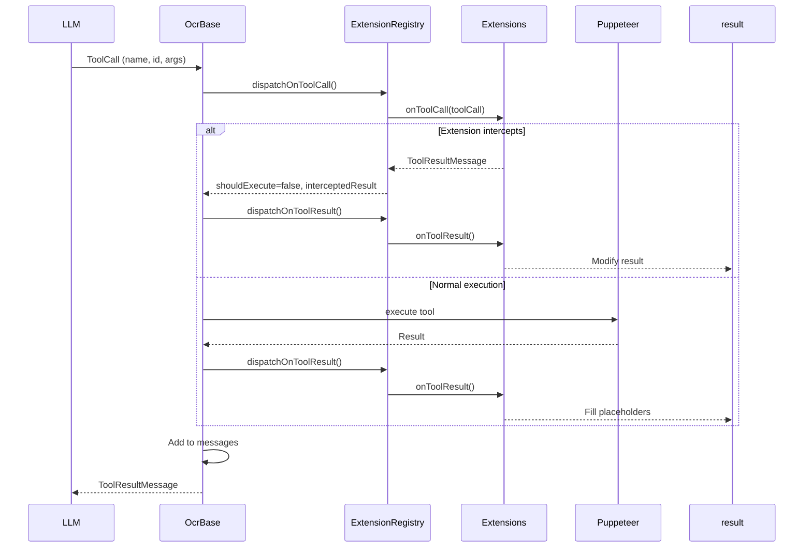

# Infrastructure Documentation

This document provides an overview of the `pi-web-search` project structure, architecture, and design patterns to help users and agents understand how the codebase is organized.

---

## Table of Contents

1. [Project Overview](#project-overview)
2. [Directory Structure](#directory-structure)
3. [Architecture Overview](#architecture-overview)
4. [Core Components](#core-components)
5. [Summarizer V2 Architecture](#summarizer-v2-architecture)
6. [Tool/Extension Pattern](#tool-extension-pattern)
7. [Configuration](#configuration)
8. [Development Guidelines](#development-guidelines)

---

## Project Overview

**pi-web-search** is a web search and fetch tool extension for the [pi](https://github.com/itterative/pi) AI coding agent. It provides:

- **Web Search**: Search using DuckDuckGo or Kagi providers
- **Web Fetch**: Fetch and summarize web content with LLM
- **Interactive Browsing**: Click, scroll, and solve captchas before summarizing
- **OCR Support**: Extract text from images (requires vision-capable LLM)

---

## Directory Structure

```
pi-web-search/
├── index.ts                    # Extension entry point
├── tools/                      # High-level tools (web-search, web-fetch, web-explore)
│   ├── web-search.ts          # Search functionality
│   ├── web-fetch.ts           # Fetch & summarize
│   └── web-explore.ts         # Interactive exploration
├── providers/                  # Search provider implementations
│   ├── base.ts                # Provider base class
│   ├── kagi-web.ts            # Kagi search provider
│   └── duckduckgo-web.ts      # DuckDuckGo provider
├── summarizers/                # OCR summarizer implementations
│   ├── base.ts                # Base summarizer
│   ├── index.ts               # V2 summarizer exports
│   ├── ocr/                   # V2 summarizer core
│   │   ├── ocr-summarizer-base.ts  # Common config/types
│   │   ├── ocr-full-v2.ts      # Full content extraction
│   │   ├── ocr-summarize-v2.ts # Concise summaries
│   │   ├── ocr-explore-v2.ts   # Full tool access
│   │   ├── ocr.ts              # Base class (OcrBase)
│   │   ├── ocr-summarizer-base.ts  # Config builder
│   │   ├── extensions/         # Extension lifecycle hooks
│   │   └── tools/              # Tool implementations
│   └── ocr-*.{ts,tsx}         # Legacy summarizers
├── common/                     # Shared utilities
│   ├── config.ts              # Configuration handling
│   ├── browser.ts             # Puppeteer setup
│   ├── constants.ts           # Constants
│   └── utils.ts               # Utility functions
├── docs/                       # Documentation
│   ├── CONFIGURATION.md       # Full config reference
│   ├── schema.json            # JSON Schema validation
│   └── INFRASTRUCTURE.md      # This file
├── test/                       # Unit tests
├── ztest/                      # Integration test instructions
├── plans/                      # Development plans
├── package.json
└── tsconfig.json
```

---

## Architecture Overview

### Entry Point

```typescript
// index.ts
export default function (pi: ExtensionAPI) {
    webSearchTool(pi);
    webFetchTool(pi);
    webExploreTool(pi);
}
```

### High-Level Tools

Each tool in `tools/` directory orchestrates the workflow:

1. **web-search.ts**: Searches using configured providers
2. **web-fetch.ts**: Fetches URL and summarizes content
3. **web-explore.ts**: Interactive exploration with full tool access

### Summarizer Hierarchy

```
OcrBase (base.ts)
├── FullOcrSummarizerV2 (ocr-full-v2.ts)
├── SummarizeOcrSummarizerV2 (ocr-summarize-v2.ts)
└── ExploreOcrSummarizerV2 (ocr-explore-v2.ts)
```

---

## Core Components

### 1. Tools (`summarizers/ocr/tools/`)

Tools are Puppeteer-based actions that the LLM can invoke:

| Tool | Purpose | Parameters |
|------|---------|------------|
| `cursor` | Move cursor to inspect elements | `x`, `y`, `description?` |
| `click` | Click elements | `x?`, `y?`, `text?`, `exact?`, `description?` |
| `scroll` | Scroll page | `direction?`, `to?`, `mode?` |
| `screenshot` | Capture viewport | `debug?` |
| `find` | Search interactive elements | `role?`, `label?`, `text?`, `multiple?` |
| `navigate` | Navigate URLs/history | `url?`, `delta?` |
| `type` | Type into inputs | `text`, `description?`, `insert?`, `submit?` |
| `keyboard` | Send keystrokes | `key`, `modifiers?`, `repeat?` |
| `wait` | Wait for content | `seconds?` |
| `checkpoint` | Save findings | `title`, `content` |
| `zoom` | Zoom into area | `x`, `y`, `width`, `height`, `level` |

### 2. Extensions (`summarizers/ocr/extensions/`)

Extensions hook into the interaction lifecycle:

| Extension | Purpose | Key Hooks |
|-----------|---------|-----------|
| `OverlayExtension` | Handle captchas/overlays | `onBeforeRun`, `onToolCall` |
| `ScreenshotExtension` | Fill screenshot placeholders | `onToolResult` |
| `CursorExtension` | Manage cursor state | `onToolCall`, `onToolResult` |
| `NavigationExtension` | Track page history | `onToolCall`, `onToolResult` |
| `CheckpointExtension` | Context compression | `onRoundStart`, `onToolCall`, `onResponse` |
| `DebugExtension` | Debug screenshots | `onBeforeCompletion` |

### 3. Configuration (`common/config.ts`)

Configuration is loaded from JSON files with priority:

1. Environment variables
2. Project config (`.pi/web-search-config.json`)
3. Global config (`~/.pi/web-search-config.json`)
4. Defaults

---

## Summarizer V2 Architecture

### Factory Pattern

Summarizers are created via factory functions:

```typescript
import {
    createFullOcrSummarizerV2,
    createSummarizeOcrSummarizerV2,
    createExploreOcrSummarizerV2,
} from "./summarizers/ocr/index";
```

### Three Modes

| Mode | Purpose | Tools | Use Case |
|------|---------|-------|----------|
| **Full** | Extract all content | Scroll only | Full page content |
| **Summarize** | Create concise summaries | Cursor, Click, Scroll, Screenshot | Quick summaries |
| **Explore** | Follow specific instructions | All tools (11 tools) | Complex tasks, form filling |

### Base Class (`OcrBase`)

The `OcrBase` class orchestrates the interaction loop:

```typescript
async run(options: OcrRunOptions): Promise<SummarizerResult> {
    // 1. Initialize viewport
    // 2. Build extension context
    // 3. Loop through rounds (maxRounds)
    // 4. Build initial message with screenshot
    // 5. For each round:
    //    - dispatchOnRoundStart()
    //    - complete() API call
    //    - processToolCalls()
    //    - dispatchOnRoundEnd()
    // 6. Force final summary
}
```

### Extension Lifecycle

Extensions implement hooks that fire at specific points:

```
1. getInitialState()          - Before run (state contribution)
2. onBeforeRun(options)        - Before run (modify options)
3. onInit()                    - Before loop (init)
4. onRoundStart()              - Each round (skip? request checkpoint?)
5. onBeforeCompletion()        - Before API (modify messages)
6. onResponse()                - After API (handle checkpoints)
7. onToolCall()                - Before tool (intercept?)
8. onToolResult()              - After tool (modify result)
9. onToolResultsComplete()     - After all tools
10. onRoundEnd()               - End of round
11. onFinalSummary()           - Before final summary
12. onComplete()               - After completion
13. onError()                  - On error
14. onMessagesChanged()        - On message changes
```

### Tool/Extension Interaction



---

## Configuration

### File Locations

- **Project**: `.pi/web-search-config.json`
- **Global**: `~/.pi/web-search-config.json`

### Quick Example

```json
{
    "$schema": "https://raw.githubusercontent.com/itterative/pi-web-search/refs/heads/main/docs/schema.json",
    "search": {
        "provider": "duckduckgo-web",
        "maxResults": 10
    },
    "fetch": {
        "model": {
            "provider": "anthropic",
            "modelId": "claude-3-haiku-20240307"
        },
        "useOcr": true
    }
}
```

### Environment Variables

| Variable | Description |
|----------|-------------|
| `KAGI_SESSION_TOKEN` | Kagi authentication token |
| `WEBSEARCH_PROVIDER` | Override provider |
| `WEBSEARCH_CONFIG_PATH` | Custom project config path |
| `WEBSEARCH_CONFIG_PATH_GLOBAL` | Custom global config path |

---

## Development Guidelines

### Adding a New Tool

1. Create `tools/my-tool.ts` extending `OcrTool`:
   ```typescript
   export class MyTool extends OcrTool<MyToolContext> {
       constructor(ctx: MyToolContext, options?: OcrToolOptions) {
           super({
               name: "my-tool",
               description: "...",
               promptSnippet: "...",
               promptGuidelines: "...",
               parameters: Type.Object({...}),
           }, ctx, options);
       }

       async execute(context: OcrToolExecutionContext, args: MyToolParameters): Promise<ToolResultMessage> {
           // Implementation
       }
   }
   ```

2. Export in `tools/index.ts`:
   ```typescript
   export { MyTool } from "./my-tool";
   ```

3. Register in summarizer constructor:
   ```typescript
   this.registerTool(new MyTool({ ... }));
   ```

### Adding a New Extension

1. Create `extensions/my-extension.ts` extending `OcrExtension`:
   ```typescript
   export class MyExtension extends OcrExtension {
       readonly name = "my-extension";

       async onBeforeCompletion(ctx, messages) {
           // Modify messages
       }

       async onToolResult(ctx, toolCall, result) {
           // Modify result
       }
   }
   ```

2. Export in `extensions/index.ts`:
   ```typescript
   export { MyExtension } from "./my-extension";
   ```

3. Register in summarizer:
   ```typescript
   this.registerExtension(new MyExtension({ ... }));
   ```

### Best Practices

- **No `any` types**: Use proper TypeScript types
- **Screenshot placeholders**: Use `screenshotPlaceholderSuccessMessage()` for tools that return images
- **Error handling**: Return `ToolResultMessage` with `isError: true` for failures
- **Navigation tracking**: Register tools with `navigationExtension.registerNavigationTool()` if they cause navigation
- **Positioning**: Support both absolute and relative coordinate systems
- **Network idle**: Use `waitForNetworkIdleAfterInteraction()` after browser actions

### Testing

- **Unit tests**: `test/` directory with Vitest
- **Integration tests**: `ztest/` directory with instruction files
- **Run tests**: `npm test` or `npx vitest run`

---

## Key Design Patterns

### 1. Factory Pattern

Summarizers are created via factory functions that bundle all dependencies:

```typescript
export function createExploreOcrSummarizerV2(config: OcrSummarizerConfig): ExploreOcrSummarizerV2;
```

### 2. Registry Pattern

Extensions are managed via `OcrExtensionRegistry` for type-safe access:

```typescript
const registry = new OcrExtensionRegistry();
registry.register(extension);
const ext = registry.get(SomeExtension);
```

### 3. Extension Hooks

Lifecycle hooks allow extensions to hook into specific points without modifying core logic.

### 4. Screenshot Placeholders

Tools return placeholder images that extensions fill in:

```typescript
protected screenshotPlaceholderSuccessMessage(
    context: OcrToolExecutionContext,
    message: string,
    addition: "raw" | "debug" = "raw"
): ToolResultMessage;
```

### 5. Context Compression

`CheckpointExtension` handles context limits by:
- Requesting checkpoints when usage threshold reached
- Blocking tools during compression mode
- Creating fresh context from checkpoint text

---

## Related Documentation

- [Configuration Reference](./CONFIGURATION.md)
- [JSON Schema](./schema.json)
- [AGENTS.md](../AGENTS.md) - Development rules
